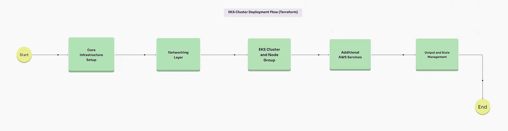
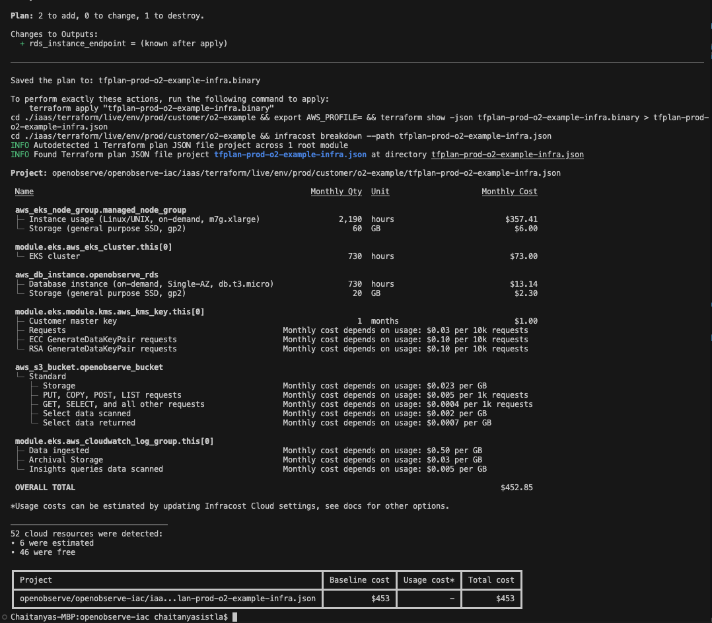

# OpenObserve Infrastructure Management

This repository provides a set of `make` commands to manage the lifecycle of your infrastructure using Terraform, along with cost estimation via Infracost.

## Terraform Overview



### 1. Provider Setup
Provider Setup (provider.tf): This specifies the providers (AWS) and region configurations.
Variables (variables.tf): Centralized file for variables that parameterize the configuration, such as region, cluster name, instance types, etc.

### 2. Networking Layer
VPC and Subnets (eks-cluster.tf): Define the VPC, subnets (public/private), and any additional networking components, like route tables and internet gateways if needed.

### 3. EKS Cluster and Node Group
EKS Cluster Setup (eks-cluster.tf): Define the EKS cluster and its version. Specify node groups, which will include details like instance type and desired capacity for Kubernetes worker nodes.
IAM Roles and Policies (policies.tf): Attach necessary IAM policies and roles for the EKS service, including any policies required by the Kubernetes service accounts to access AWS resources (e.g., S3, RDS).

### 4. Additional AWS Services
S3 for Object Storage (s3-iam.tf): Create an S3 bucket specifically for OpenObserve, if it’s used for storing observability data. Set up an IAM role with S3 permissions for OpenObserve access.
RDS PostgreSQL Database (rds-postgres.tf): Provision an RDS PostgreSQL instance for OpenObserve’s backend storage. Configure security groups and IAM roles, allowing OpenObserve and EKS to connect to RDS securely.

### 5. Output and State Management
Outputs (outputs.tf): Output details that other resources or configurations might need (e.g., RDS endpoint, S3 bucket name, IAM roles).
State Management (terraform.tfstate): state file will be moved to S3 and DynamoDB for remote state management and locking.

## NOTE

This release consists terraform files and other files that help you to build an EKS and deploy OpenObserve. The only manual intervention will be to configure your DNS in Route53 by grabbing the NLB.

## OpenTofu companitbility

To use this repository with opentofu, you need to modify provider.tf and then use the Makefile that is placed under opentofu directory. 

## Prerequisites

Before you begin, ensure that the following tools are installed:

- [Terraform](https://www.terraform.io/downloads.html) or [OpenTofu](https://opentofu.org/docs/intro/install/)
- [AWS CLI](https://docs.aws.amazon.com/cli/latest/userguide/install-cliv2.html)
- [Infracost](https://www.infracost.io/docs/)

### Environment Variables

Make sure you have the following environment variables configured:

- `ENV`: The environment you are targeting (e.g., `dev`, `staging`, `prod`).
- `CUSTOMER_NAME`: The name of the customer for whom the infrastructure is being managed.
- `AWS_PROFILE`: The AWS profile to use for authentication.
- `API_KEY`: Your Infracost API key for cost estimation.

---

## Usage

### 1. Modify tfvars (`init`)

```bash
root_user_email    = "example@openobserve.ai"
root_user_password = "CustomSecurePassword123"
o2_domain          = "example.openobserve.ai"
o2_dex_domain      = "example-auth.openobserve.ai"
secret_name        = "example"
```

### 2. Initialize Terraform (`init`)

Before you can plan or apply your Terraform configuration, you need to initialize the working directory containing your configuration files. This command will download all necessary Terraform modules and providers.

```bash
make init ENV=<environment> CUSTOMER_NAME=<customer> AWS_PROFILE=<aws_profile>
```

For example:

```bash
make init ENV=dev CUSTOMER_NAME=example AWS_PROFILE=my-aws-profile
```

### 3. Plan Terraform Changes (`plan`)

The `plan` command will show the changes Terraform will apply to the infrastructure without making any actual changes. This is useful for reviewing proposed changes.

```bash
make plan ENV=<environment> CUSTOMER_NAME=<customer> AWS_PROFILE=<aws_profile>
```

For example:

```bash
make plan ENV=dev CUSTOMER_NAME=example AWS_PROFILE=my-aws-profile
```

### 4. Apply Terraform Changes (`apply`)

After reviewing the plan, you can apply the changes using the `apply` command.

```bash
make apply ENV=<environment> CUSTOMER_NAME=<customer> AWS_PROFILE=<aws_profile>
```

For example:

```bash
make apply ENV=prod CUSTOMER_NAME=example AWS_PROFILE=my-aws-profile
```

### 5. Run Pre Setup to install dependencies (`o2_pre_setup`)

After applying, you can run pre deployment.

```bash
make o2_pre_setup ENV=<environment> CUSTOMER_NAME=<customer> AWS_PROFILE=<aws_profile>
```

For example:

```bash
make o2_pre_setup ENV=prod CUSTOMER_NAME=example AWS_PROFILE=my-aws-profile
```

### 6. Run Pre Setup to install dependencies (`o2_deployment`)

After pre deployment, you can deploy helm chart using `o2_deployment`.

```bash
make o2_deployment ENV=<environment> CUSTOMER_NAME=<customer> AWS_PROFILE=<aws_profile>
```

For example:

```bash
make o2_deployment ENV=prod CUSTOMER_NAME=example AWS_PROFILE=my-aws-profile
```

### 7. Destroy Terraform Infrastructure (`destroy`) 

If you need to tear down the infrastructure, use the `destroy` command. **Be careful**, as this will remove all resources managed by Terraform for the specified environment and customer.

```bash
make destroy ENV=<environment> CUSTOMER_NAME=<customer> AWS_PROFILE=<aws_profile>
```

For example:

```bash
make destroy ENV=dev CUSTOMER_NAME=example AWS_PROFILE=my-aws-profile
```

### 8. Estimate Infrastructure Costs (`estimate`)

You can estimate the cost of your Terraform infrastructure using Infracost with the `estimate` command. This command will generate a cost breakdown based on your Terraform plan.

```bash
make estimate ENV=<environment> CUSTOMER_NAME=<customer> AWS_PROFILE=<aws_profile> API_KEY=<infracost_api_key>
```

For example:

```bash
make estimate ENV=prod CUSTOMER_NAME=example AWS_PROFILE=my-aws-profile API_KEY=your-infracost-api-key
```

The `estimate` command will:
- Generate a Terraform plan.
- Convert the plan to JSON.
- Use Infracost to generate a cost breakdown based on the plan.

